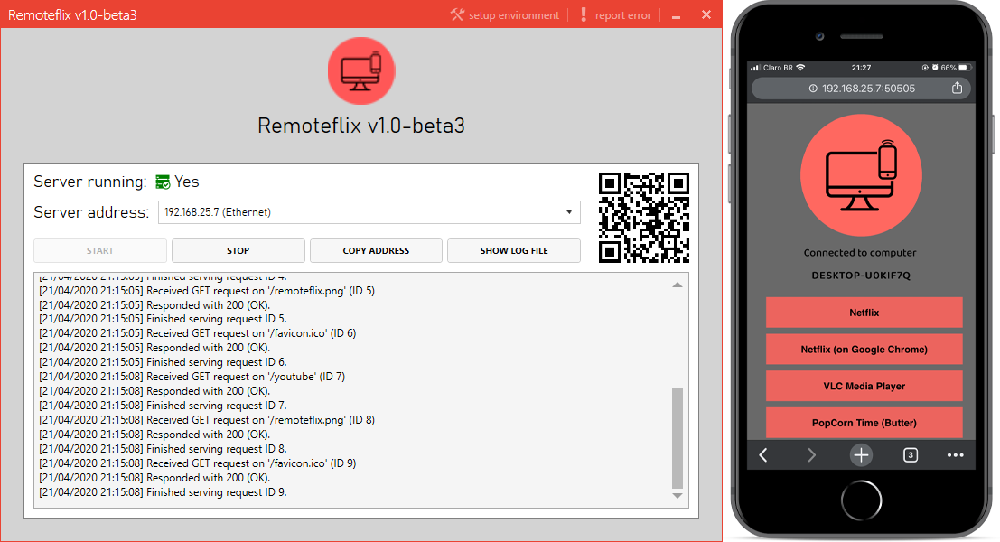

<div align="center">
  
  [](https://github.com/schdck/RemoteFlix)

  # RemoteFlix  (beta)
  
 [](https://ci.appveyor.com/project/schdck/remoteflix/branch/master)
 [](https://github.com/schdck/RemoteFlix/issues)
 [](https://github.com/schdck/RemoteFlix/blob/master/LICENSE)
 
  :cinema: RemoteFlix is a desktop application aimed to allow you to control any <br> media player running on your computer directly from a web-browser in your phone.
</div>

<hr>



## Why?
Well, basically because I'm lazy and didn't like to get up and pause my video every time I wanted to answer a text.

## How?
The idea behind RemoteFlix is very simple. Most media players provide shortcuts that enable you to perform a task (e.g. pausing the video). What RemoteFlix do is allow you to execute these (pre-defined) shortcuts from your phone's browser.

To do that, it exposes a very simple web-server which is responsible for listing the avaliable players and actions (which we call commands) and handling requests.

When a request is received, the application will look for the player's process on the machine and send the keys corresponding to the command's shortcut to it.

## Installing and running
There is a setup (use this if you want to have RemoteFlix auto-starting with Windows) and portable binaries avaliable for each version on the [releases](https://github.com/schdck/RemoteFlix/releases) page.

After you run the executable, it's pretty straightforward:

1. Double-click the RemoteFlix's icon next to Window's clock to open the application.
2. Click the `Setup environment` button at the top right or take a look at the **Setting up the environment** section bellow.
3. RemoteFlix will try to use the correct server address, but in case it guessed wrong you can just select the right one from the combo box.
4. Scan the QR Code using your phone.

## Setting up the environment

The following steps are exactly what `Setup environment` button does. But if you are an advanced user and for any reason wants to run them yourself, here they are. Remember to run them from an elevated command prompt.

1. Allow RemoteFlix's URL to [every user on your computer](https://serverfault.com/a/678675/382770):

``` bash
netsh http add urlacl url="http://+:50505/" sddl=D:(A;;GX;;;S-1-1-0)
```

2. Allow RemoteFlix through Windows Firewall:

``` bash
netsh advfirewall firewall add rule name="RemoteFlix_Port" localport=50505 direction=in action=allow protocol=tcp
```

## Supported media players
* Netflix
* VLC Media Player
* Popcorn Time (Butter)
* YouTube

Want support for a player that isn't listed? Please [let us know](https://github.com/schdck/RemoteFlix/issues/new?assignees=&labels=&template=player-request.md&title=%5BPLAYER+REQUEST%5D). Pull requests are also welcome.

## Troubleshooting
If you are running RemoteFlix but can't connect to it, you can try these steps:

* Try to connect to it from a browser running on your computer (this will help narrowing down the issue)
* Make sure that you are connected to the same network on both your computer and your phone
* Try restarting the application if you changed the network your computer is connected to
* Click the "Setup environment" button on the application, this will open the needed ports on Windows Firewall
* If you are not using Windows Firewall, make sure that your firewall is not in the way. RemoteFlix is using TCP port 50505 by default
